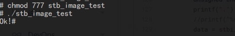

# stb-image

## 简介
> stb_image主要是C/C++实现的图像解码库。



## 下载安装
直接在OpenHarmony-SIG仓中搜索stb-image并下载。

## 使用说明
以OpenHarmony 3.1 Beta的rk3568版本为例

1. 库代码存放路径：./third_party/stb-image

2. 修改添加依赖的编译脚本，路径：/developtools/bytrace_standard/ohos.build

```
  {
     "subsystem": "developtools",
     "parts": {
       "bytrace_standard": {
         "module_list": [
           "//developtools/bytrace_standard/interfaces/innerkits/native:bytrace_core",
           "//developtools/bytrace_standard/bin:bytrace_target",
           "//developtools/bytrace_standard/bin:bytrace.cfg",
           "//developtools/bytrace_standard/interfaces/kits/js/napi:bytrace",
           "//third_party/stb-image:stb_image",
           "//third_party/stb-image:stb_image_test"
         ],
         "inner_kits": [
           {
             "type": "so",
             "name": "//developtools/bytrace_standard/interfaces/innerkits/native:bytrace_core",
             "header": {
               "header_files": [
                 "bytrace.h"
               ],
               "header_base": "//developtools/bytrace_standard/interfaces/innerkits/native/include"
             }
           }
         ],
          "test_list": [
           "//developtools/bytrace_standard/bin/test:unittest"
         ]
       }
     }
   }
```

3. 用命令 ./build.sh --product-name rk3568 --ccache 编译

4. 生成库文件路径：out/rk3568/developtools/profiler，该路径会生成库文件

## 接口说明

1. 加载图像数据
   `stbi_write_jpg(char const *filename, int x, int y, int comp, const void *data, int quality)`
   
2. 修改图像尺寸
   `stbir_resize(const void *input_pixels , int input_w , int input_h , int input_stride_in_bytes, void *output_pixels, int output_w, int output_h, int output_stride_in_bytes, stbir_datatype datatype, int num_channels, int alpha_channel, int flags, stbir_edge edge_mode_horizontal, stbir_edge edge_mode_vertical, stbir_filter filter_horizontal,  stbir_filter filter_vertical, stbir_colorspace space, void *alloc_context)`

3. 将像素数据写入文件
   `stbi_write_png(char const *filename, int x, int y, int comp, const void *data, int stride_bytes)`

4. 保存 jpg 格式图片
   `stbi_write_jpg(char const *filename, int x, int y, int comp, const void *data, int quality)`


## 兼容性
支持OpenHarmony API version 8 及以上版本。

## 目录结构
````
|---- stb-image   #库的具体实现都在此目录下
|     |---- data   #图片资源
|     |---- deprecated   #弃用代码
|     |---- docs   #文档说明
|     |---- tests   #单元测试用例
|     |---- tools   #工具模块
|     |---- README.md   #安装使用方法
````

## 贡献代码
使用过程中发现任何问题都可以提 [Issue](https://gitee.com/openharmony-sig/stb-image/issues) 给我们，当然，我们也非常欢迎你给我们发 [PR](https://gitee.com/openharmony-sig/stb-image/pulls) 。

## 开源协议
本项目基于 [MIT License](https://gitee.com/openharmony-sig/stb-image/blob/master/LICENSE) ，请自由地享受和参与开源。